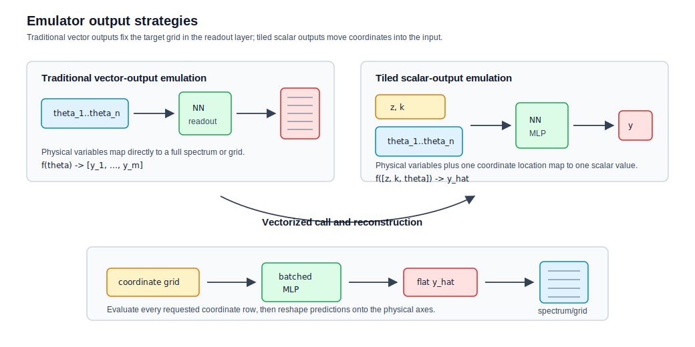
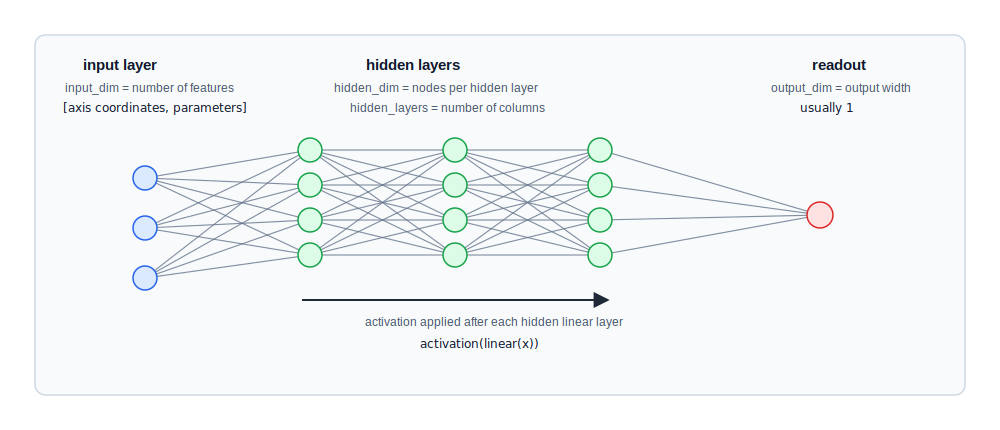
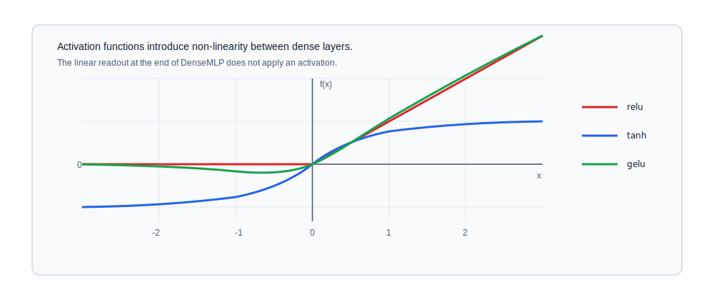

# Architecture

**Navigation:** [README](../README.md) · [Architecture](architecture.md) · [Preprocessing](preprocessing.md) · [JAX Training](jax-training.md) · [Checkpointing](checkpoint.md) · [Inference](inference.md) · [Examples](examples.md)

The emulator architecture is a simple JAX implementation of the
scalar-regression idea used by
[GlobalEmu](https://github.com/htjb/globalemu)
([arXiv:2104.04336](https://arxiv.org/abs/2104.04336)) and
[AstroEmu](https://astroemu.readthedocs.io/en/latest/tutorial/). Instead of
training a network to emit a whole spectrum or grid in one pass, independent
coordinates are included in the input row and the network predicts one scalar
observable value.




| Approach | Input row | Network output | Reconstruction |
| --- | --- | --- | --- |
| Vector-output emulator | Physical Parameters | Full signal vector | Usually none |
| Tiled scalar-output emulator | Axis coordinate(s) + Physical Parameters | Scalar target value | Vectorized call |

## DenseMLP and Configuration
The `DenseMLP` module is a Flax NNX module with hidden linear layers, a configured
activation, and a linear scalar readout.

The network is built from a small set of configuration values. These values set
the feature width at the input, the number and width of hidden layers, the
non-linearity used between hidden layers, and the output width of each model
call.



| `DenseMLP` input | Definition |
| --- | --- |
| `in_features` | Number of input features after tiling and preprocessing. This is axis coordinates plus astrophysical parameters. |
| `hidden_features` | Width of every hidden layer. |
| `hidden_layers` | Number of hidden linear layers before the final readout. |
| `activation` | Non-linearity applied after each hidden linear layer. |
| `out_features` | Number of output values per input row. Current workflows use scalar regression, so this is usually `1`. |
| `rngs` | Flax NNX random-number container used to initialise the network parameters. |


## Activation Functions

The role of the activation functions is to introduce the non-linearity in the network. Without them,
a stack of dense layers would still only represent a linear map.

| Name | Implementation | Equation |
| --- | --- | --- |
| `relu` | `jax.nn.relu` | `relu(x) = max(0, x)` |
| `tanh` | `jax.numpy.tanh` | `tanh(x) = (exp(x) - exp(-x)) / (exp(x) + exp(-x))` |
| `gelu` | `jax.nn.gelu` | Conceptually `gelu(x) = x Phi(x)`, where `Phi` is the standard normal CDF. JAX uses its approximate form by default. |




## Example
```python
from flax import nnx

from jax_emu.architectures.mlp import DenseMLP

model = DenseMLP(
    in_features=8,
    hidden_features=64,
    hidden_layers=3,
    out_features=1,
    activation="relu",
    rngs=nnx.Rngs(0),
)
```

---

**Navigation:** [README](../README.md) · [Architecture](architecture.md) · [Preprocessing](preprocessing.md) · [JAX Training](jax-training.md) · [Checkpointing](checkpoint.md) · [Inference](inference.md) · [Examples](examples.md)
