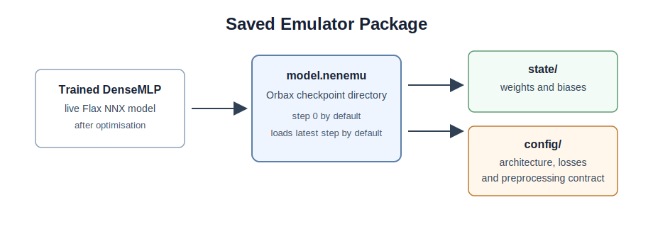

# Checkpointing

**Navigation:** [README](../README.md) · [Architecture](architecture.md) · [Preprocessing](preprocessing.md) · [JAX Training](jax-training.md) · [Checkpointing](checkpoint.md) · [Inference](inference.md) · [Examples](examples.md)

A trained emulator is more than a set of neural-network weights. To reuse the
model safely, inference also needs to know how physical inputs were transformed,
scaled, and ordered before they reached the network.

The checkpoint therefore stores:

```text
model architecture + model weights + preprocessing contract
```



## The `.nenemu` Package

The package is an Orbax checkpoint directory with a `.nenemu` suffix. It is a
directory, not a single binary file.

```text
t21_model.nenemu/
  0/
    state/     (Flax NNX model state: weights and biases)
    config/    (JSON metadata: architecture, losses, preprocessing)
```

The current save function writes one checkpoint step. Loading defaults to the
latest available step, so users normally do not need to pass a step number.

## Checkpoint Metadata

`CheckpointMetadata` stores the non-weight information needed to turn a trained
MLP back into a physical emulator.

| Item | Definition |
| :--- | :--- |
| `model_name` | Name of the emulator family, for example `t21` or `delta21`. |
| `package_version` | Version label for the code that wrote the checkpoint. |
| `emulator_spec` | The axis, parameter, and target-transform contract. |
| `input_scaling` | Training-set scaling statistics for every input feature. |
| `target_scaling` | Target scaling metadata, if target scaling was used. |
| `training_config` | Architecture, optimizer, training, and feature-order settings. |

The key point is that `emulator_spec`, `input_scaling`, and `target_scaling`
are part of the saved model. Without them, the network can still make numerical
predictions, but those predictions are no longer tied to the physical training
pipeline.

## Saving

The shared `save` function stores the live `DenseMLP` state with Orbax and
writes the JSON metadata alongside it.

```python
from dataclasses import asdict
from pathlib import Path

from emulators_21cmspace.t21.data import t21_spec
from jax_emu.utils import CheckpointMetadata, save

# Store the preprocessing and training information needed for inference.
metadata = CheckpointMetadata(
    model_name="t21",
    package_version="0.1.0",
    emulator_spec=t21_spec(),
    input_scaling=prepared.feature_scaling,
    target_scaling=prepared.target_scaling,
    training_config={
        "mlp": asdict(config.mlp),
        "optimizer": asdict(config.optimizer),
        "training": asdict(config.training),
        "feature_names": list(prepared.feature_names),
    },
)

# Write the trained model state and metadata to an Orbax checkpoint package.
package_path = save(
    Path("outputs/t21_model.nenemu"),
    model,
    train_losses=history.train_losses,
    val_losses=history.validation_losses,
    loss=config.training.loss_name,
    metadata=metadata,
    epochs=config.training.epochs,
    patience=config.training.early_stopping_patience,
    learning_rate=config.optimizer.learning_rate,
    weight_decay=config.optimizer.weight_decay,
)
```

During saving, the model is split into:

```text
DenseMLP graph structure -> reconstructed from saved architecture settings
DenseMLP state           -> saved by Orbax as JAX arrays
```

This keeps the checkpoint close to the way Flax NNX represents models: the
architecture tells us what to rebuild, and the state supplies the trained
weights.

## Loading

The shared `load` function reads the JSON config first. It uses the saved
architecture settings to rebuild an empty `DenseMLP`, restores the Orbax state,
and returns a live model.

```python
from jax_emu.utils import load

# Load the latest checkpoint step from the package.
package = load("outputs/t21_model.nenemu")

# Extract the reconstructed model and the saved metadata.
model = package["model"]
metadata = package["metadata"]
hyperparams = package["hyperparams"]
```

The returned `model` is ready for a forward pass. The returned `metadata` is
what lets inference code prepare inputs and undo output transforms in the same
way as the original training run.

## Inference Contract

At inference time the saved metadata defines the full route:

```text
physical inputs
-> parameter and axis transforms
-> input scaling
-> DenseMLP
-> inverse target scaling
-> inverse target transform
-> physical prediction
```

This route is implemented by the generic `jax_emu.Emulator` class. The
emulator-specific loaders, such as the Delta21 and T21 helpers, mainly validate
the saved package and attach any dataset-specific parameter adapter needed to
accept raw simulation parameter tables.

For example, if a `Delta21` model was trained with `log10(k)` and
`log10(Delta21 + 1e-8)`, the checkpoint records those choices. The inference
helper can then apply the same forward transforms before the network and the
same inverse transforms after the network.

```python
from emulators_21cmspace.delta21.emulator import (
    build_delta21_fixed_grid_emulator,
    load_delta21_package,
)

# The emulator-specific loader validates that the checkpoint metadata is present.
package = load_delta21_package("outputs/delta21_model.nenemu")

# Build the reusable emulator object once for this fixed (z, k) grid.
# Pass compile_parameters to pay the first JIT compilation cost immediately.
emulator = build_delta21_fixed_grid_emulator(
    package,
    z,
    k,
    compile_parameters=physical_parameters,
)

# Reuse the compiled fixed-grid forward model inside an inference loop.
delta21 = emulator.emulate(physical_parameters)
```

For one-off calls, the convenience wrapper can still load and predict in one
step:

```python
from emulators_21cmspace.delta21.emulator import predict_delta21

delta21 = predict_delta21(
    "outputs/delta21_model.nenemu",
    physical_parameters,
    z,
    k,
)
```

For repeated inference on one fixed grid, prefer
`build_delta21_fixed_grid_emulator`. It keeps disk I/O, metadata validation,
and grid construction outside the repeated numerical path. The older
`build_delta21_emulator` route is still useful when the requested grid changes
from call to call.

---

**Navigation:** [README](../README.md) · [Architecture](architecture.md) · [Preprocessing](preprocessing.md) · [JAX Training](jax-training.md) · [Checkpointing](checkpoint.md) · [Inference](inference.md) · [Examples](examples.md)
