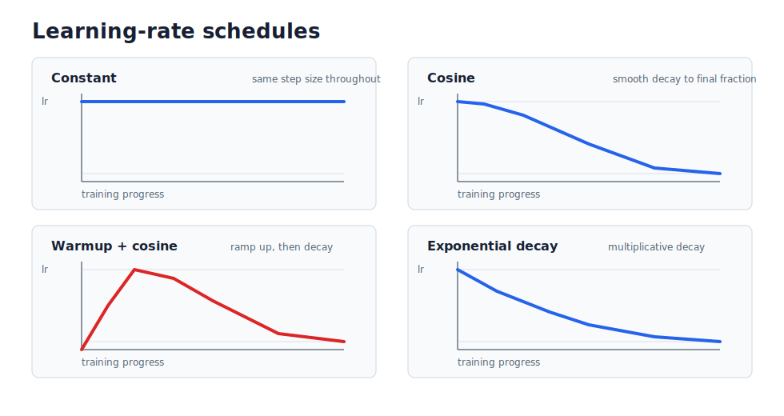

# JAX Training

**Navigation:** [README](../README.md) · [Architecture](architecture.md) · [Preprocessing](preprocessing.md) · [JAX Training](jax-training.md) · [Checkpointing](checkpoint.md) · [Examples](examples.md)

Once a `DenseMLP` has been initialized, the next step is to train it against
prepared simulation data. Training updates the network parameters so that the
model predictions match the target emulator values as closely as possible.

The trainer uses a loss function to measure prediction error, automatic
differentiation to compute gradients of that loss, and an Optax optimizer to
update the model parameters.

## Training Parameters

`train_mlp_regressor` is the shared training entry point. It receives an
existing model, prepared train/validation arrays, and the main optimization
settings:

| Parameter | Definition |
| :--- | :--- |
| `model` | The initialized `DenseMLP` network to be trained. |
| `train_features` | 2D array of input features for the training set (coordinates + parameters). |
| `train_targets` | 1D array of ground-truth scalar values for the training set. |
| `validation_features` | 2D array of input features for the validation set. |
| `validation_targets` | 1D array of ground-truth scalar values for the validation set. |
| `epochs` | The number of complete passes through the training dataset. |
| `batch_size` | Number of rows used in each optimizer update. |
| `learning_rate` | Initial or peak optimizer step size. |
| `weight_decay` | AdamW regularization term used to penalize large weights. |
| `learning_rate_schedule` | Schedule name: `constant`, `cosine`, `warmup_cosine`, or `exponential_decay`. |
| `learning_rate_final_fraction` | Final fraction for decay schedules. `0.05` means final rate = `learning_rate * 0.05`. |
| `learning_rate_warmup_epochs` | Number of warmup epochs for `warmup_cosine`; ignored by the other schedules. |
| `max_runtime_seconds` | Optional wall-clock training budget for graceful shutdown on long jobs. |
| `shutdown_margin_seconds` | Time reserved after training for test evaluation and checkpoint saving. |
| `seed` | Random seed for deterministic shuffling of the training data. |

## The Training Step

For each mini-batch, the trainer runs a compiled JAX/NNX training step:

1. **Forward pass**: Pass the mini-batch features through the network.
2. **Loss calculation**: Compute mean squared error between predictions and
   targets.
3. **Gradient calculation**: Use JAX automatic differentiation to compute
   gradients of the loss with respect to the trainable parameters.
4. **Optimizer update**: Apply the AdamW update to the live NNX model state.

## Code Example

```python
from jax_emu.training import train_mlp_regressor

model, history = train_mlp_regressor(
    model,
    train_features=train_features,
    train_targets=train_targets,
    validation_features=val_features,
    validation_targets=val_targets,
    epochs=1000,
    batch_size=1024,
    learning_rate=1e-3,
    weight_decay=1e-4,
    learning_rate_schedule="warmup_cosine",
    learning_rate_final_fraction=0.05,
    learning_rate_warmup_epochs=5,
    seed=42,
)
```

## Learning-Rate Schedules

A learning-rate schedule changes the optimizer step size during training. The
default is `constant`, which keeps the same step size throughout training.

| Schedule | Behaviour |
| :--- | :--- |
| `constant` | Use `learning_rate` for every optimizer step. |
| `cosine` | Smoothly decay from `learning_rate` to `learning_rate * learning_rate_final_fraction`. |
| `warmup_cosine` | Ramp from zero to `learning_rate`, then apply cosine decay to the final fraction. |
| `exponential_decay` | Multiplicatively decay from `learning_rate` to the final fraction. |

The scheduler parameters are:

| Parameter | Used by | Meaning |
| :--- | :--- | :--- |
| `learning_rate` | all schedules | Initial rate for `constant`, `cosine`, and `exponential_decay`; peak rate for `warmup_cosine`. |
| `learning_rate_final_fraction` | `cosine`, `warmup_cosine`, `exponential_decay` | Final rate as a fraction of `learning_rate`. Ignored by `constant`. |
| `learning_rate_warmup_epochs` | `warmup_cosine` | Number of epochs used to ramp from zero to `learning_rate`. |
| `epochs` | decay schedules | Schedule horizon. A 10,000 epoch run decays more slowly than a 1,000 epoch run. |



Schedules are evaluated per mini-batch update, not only once per epoch. The
trainer converts `epochs` and `steps_per_epoch` into a total number of optimizer
steps:

```python
from jax_emu.training import build_learning_rate_schedule

schedule = build_learning_rate_schedule(
    learning_rate=1e-3,
    schedule_name="cosine",
    steps_per_epoch=100,
    epochs=1000,
    final_fraction=0.05,
)
```

The current `exponential_decay` schedule is defined by the final fraction over
the full schedule horizon. It does not use a separate half-life parameter.

The high-level training commands expose the same scheduler settings:

```bash
21cmspace-delta21-train \
  --dataset-root /path/to/21cmspace/data \
  --output outputs/delta21_model.nenemu \
  --learning-rate-schedule warmup_cosine \
  --learning-rate-final-fraction 0.05 \
  --learning-rate-warmup-epochs 5
```

## Evaluation Metrics

At the end of every epoch, after all training mini-batches have been used to
update the network, the trainer records two losses:

| Metric | Meaning |
| :--- | :--- |
| **Training loss** | Error on the data used to update the model parameters. |
| **Validation loss** | Error on held-out data that was not used for parameter updates. |

The training loss shows whether the network is fitting the training set. The
validation loss shows whether that fit generalises to unseen simulations.

## Loss Curve Analysis

The trainer returns a `TrainingHistory` object containing the training and
validation loss curves. After evaluating the held-out test set, these can be
plotted directly:

```python
from jax_emu.analysis import plot_training_history

plot_training_history(
    history,
    test_loss=test_loss,
    model_name="delta21",
    output_path="outputs/delta21_loss_curves.png",
)
```

The same curves are also saved inside the `.nenemu` package. The high-level
training workflows write an adjacent `.summary.json` file containing the final
test loss, so a saved run can be inspected later:

```python
from jax_emu.analysis import plot_package_losses

plot_package_losses(
    "outputs/delta21_model.nenemu",
    output_path="outputs/delta21_loss_curves.png",
)
```

The plot shows training loss, validation loss, the best validation epoch when
available, and the held-out test loss in the top-right corner.

## Slurm Wall Time

The high-level workflows save the `.nenemu` package after the trainer returns.
For Slurm jobs, the trainer can therefore stop early when the wall-clock budget
is nearly exhausted:

```bash
21cmspace-t21-train \
  --dataset-root /path/to/21cmspace/data \
  --output outputs/t21_model.nenemu \
  --max-runtime-seconds 27000 \
  --shutdown-margin-seconds 900
```

The trainer checks this after every epoch:

```text
elapsed time + estimated next epoch + shutdown margin >= max runtime
-> stop training cleanly
-> evaluate the test set
-> save the checkpoint package
```

For Slurm scripts, also request an early signal before the wall limit:

```bash
#SBATCH --signal=B:TERM@900
```

This gives Python a chance to catch `SIGTERM`, finish the current epoch, and
return to the normal save path. A hard kill cannot be handled safely.

## Efficient JAX Training

The training code is designed for prepared arrays that may be too large to keep
fully resident in GPU memory. The usual workflow is therefore host-to-device
streaming:

1. **Store arrays on the host**: Prepared feature and target arrays can remain
   in system memory.
2. **Train on mini-batches**: Only the current fixed-shape mini-batches are
   transferred to the JAX device.
3. **Prefetch future batches**: While the device trains on one batch, the next
   batches can be prepared and queued with `jax.device_put`.

### Training Pipeline Flow

The aim is to reduce idle accelerator time. Without prefetching, each iteration
waits for host preparation and device transfer before training can begin. With
prefetching, preparation and transfer for later batches overlap with the current
compiled training step.


---

**Navigation:** [README](../README.md) · [Architecture](architecture.md) · [Preprocessing](preprocessing.md) · [JAX Training](jax-training.md) · [Checkpointing](checkpoint.md) · [Examples](examples.md)
