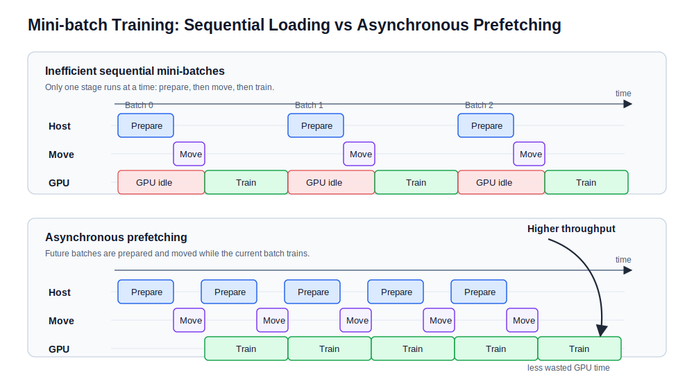

# JAX Training

Once a `DenseMLP` has been initialized, the next step is to train it against
prepared simulation data. Training updates the network parameters so that the
model predictions match the target emulator values as closely as possible.

The trainer uses a loss function to measure prediction error, automatic
differentiation to compute gradients of that loss, and an Optax optimizer to
update the model parameters.

## Dataset Splitting

Before training begins, the prepared simulation data is split into three
subsets:

- **Training set**: Data used to update the model parameters.
- **Validation set**: Held-out data used during training to monitor
  generalization and drive early stopping.
- **Test set**: A final held-out split used after training to report emulator
  performance.

This split is handled in the data preparation workflow before the arrays are
passed into the shared trainer.

## Training Parameters

`train_mlp_regressor` is the shared training entry point. It receives an
existing model, prepared train/validation arrays, and the main optimization
settings:

| Parameter | Definition |
| :--- | :--- |
| `model` | The initialized `DenseMLP` network to be trained. |
| `train_features` | 2D array of input features for the training set (coordinates + parameters). |
| `train_targets` | 1D array of ground-truth scalar values for the training set. |
| `validation_features` | 2D array of input features for the validation set. |
| `validation_targets` | 1D array of ground-truth scalar values for the validation set. |
| `epochs` | The number of complete passes through the training dataset. |
| `batch_size` | Number of rows used in each optimizer update. |
| `learning_rate` | Optimizer step size. |
| `weight_decay` | AdamW regularization term used to penalize large weights. |
| `seed` | Random seed for deterministic shuffling of the training data. |

## The Training Step

For each mini-batch, the trainer runs a compiled JAX/NNX training step:

1. **Forward pass**: Pass the mini-batch features through the network.
2. **Loss calculation**: Compute mean squared error between predictions and
   targets.
3. **Gradient calculation**: Use JAX automatic differentiation to compute
   gradients of the loss with respect to the trainable parameters.
4. **Optimizer update**: Apply the AdamW update to the live NNX model state.

## Code Example

```python
from jax_emu.training.trainer import train_mlp_regressor

model, history = train_mlp_regressor(
    model,
    train_features=train_features,
    train_targets=train_targets,
    validation_features=val_features,
    validation_targets=val_targets,
    epochs=1000,
    batch_size=1024,
    learning_rate=1e-3,
    weight_decay=1e-4,
    seed=42,
)
```

## Efficient JAX Training

The training code is designed for prepared arrays that may be too large to keep
fully resident in GPU memory. The usual workflow is therefore host-to-device
streaming:

1. **Store arrays on the host**: Prepared feature and target arrays can remain
   in system memory.
2. **Train on mini-batches**: Only the current fixed-shape mini-batches are
   transferred to the JAX device.
3. **Prefetch future batches**: While the device trains on one batch, the next
   batches can be prepared and queued with `jax.device_put`.

### Training Pipeline Flow

The aim is to reduce idle accelerator time. Without prefetching, each iteration
waits for host preparation and device transfer before training can begin. With
prefetching, preparation and transfer for later batches overlap with the current
compiled training step.


