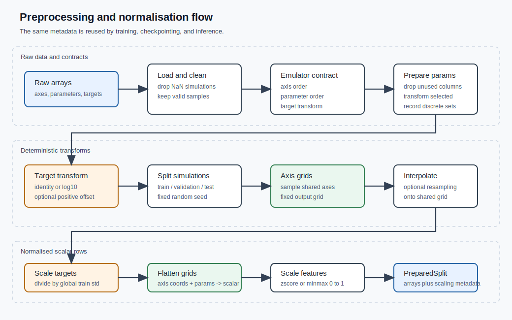

# Preprocessing and Normalisation

Preprocessing turns raw simulation outputs into the arrays used by the neural
network. It defines the contract between physical quantities and emulator
inputs/outputs.

For scalar-output emulators, the core map is:

```text
physical parameters + coordinates -> network features -> scalar target
```

The same preprocessing contract must be reused at inference time. Physical
inputs are transformed before the network, and network outputs are transformed
back afterwards.

## Motivation

The network should learn in a numerically well-behaved space, not necessarily
in the raw physical units. Preprocessing can make the learning problem simpler:

```text
wide physical ranges -> compact training ranges
positive skewed values -> log-space values
heterogeneous columns -> comparable network inputs
```

The goal is not to change the science target. The goal is to present the same
physical problem in a coordinate system that is easier for the optimizer.



## Workflow

A typical workflow is:

1. Load raw simulation parameters, output axes, and target arrays.
2. Clean failed simulations or NaN targets.
3. Apply deterministic transforms to selected parameters, axes, or targets.
4. Split simulations into train, validation, and test sets.
5. Resample targets onto a shared grid when fixed output axes are needed.
6. Flatten spectra or grids into scalar regression rows.
7. Compute feature and target scaling from the training split only.
8. Reuse the same metadata for validation, test, and inference.

In short:

```text
raw arrays -> clean -> transform -> split -> resample -> flatten -> scale
```

## Why Transform and Normalise?

Neural networks train more reliably when inputs and targets occupy comparable
numerical ranges. Physical simulation parameters often span many orders of
magnitude, so the raw values may be a poor coordinate system for optimisation.

| Operation | Why use it? | Example |
| --- | --- | --- |
| `log10` transform | Compresses positive quantities spanning orders of magnitude. | `f_star -> log10f_star` |
| `log10(y + offset)` | Keeps positive targets finite before taking a logarithm. | power spectrum values |
| `zscore` normalisation | Centres continuous features and scales by training-set scatter. | redshift or log-parameters |
| `minmax_zero_to_one` | Maps bounded or discrete values onto a compact range. | discrete model choices |
| `identity` | Leaves a value unchanged when its physical scale is already suitable. | already-normalised inputs |

## Parameter Transforms

Raw parameter tables often need a small amount of structure:

```text
drop unused columns -> transform selected columns -> record discrete values
```

```python
from jax_emu.data_preprocessing import prepare_feature_matrix

prepared_parameters = prepare_feature_matrix(
    raw_parameters,
    column_names=("f_star", "f_x", "alpha", "unused"),
    transform_params=("f_star", "f_x"),
    discard_params=("unused",),
    discrete_params=("alpha",),
)

print(prepared_parameters.feature_names)
print(prepared_parameters.values.shape)
print(prepared_parameters.discrete_values)
```

The output stores both the numerical matrix and the feature names. The feature
order is part of the model contract.

## Axis and Target Transforms

Transforms define the coordinate system used for training. If a transform is
applied before training, the inverse transform is needed after inference.

```python
from jax_emu.data_preprocessing import apply_transform, invert_transform

log_target = apply_transform(target, transform="log10", offset=1e-8)
physical_target = invert_transform(log_target, transform="log10", offset=1e-8)
```

Transform and normalisation are separate steps:

```text
physical value -> transform -> normalise -> network
```

## Dataset Splitting

Split at the simulation level before flattening. This keeps each parameter row
paired with its full target array.

```python
from jax_emu.data_preprocessing import split_simulations

(
    train_parameters,
    validation_parameters,
    test_parameters,
    train_targets,
    validation_targets,
    test_targets,
) = split_simulations(
    prepared_parameters.values,
    transformed_targets,
    train_size=0.6,
    validation_size=0.2,
    test_size=0.2,
    random_state=42,
)
```

Fit preprocessing statistics from the training split only. Reuse them for
validation, test, and inference.

## Feature Scaling

Feature scaling maps each input column into the numerical space seen by the
network.

| Method | Operation | Typical use |
| --- | --- | --- |
| `identity` | `x` | Already suitable values |
| `zscore` | `(x - mean) / std` | Continuous features |
| `minmax_zero_to_one` | `(x - min) / (max - min)` | Bounded or discrete features |
| `minmax_minus_one_to_one` | Scale to `[-1, 1]` | Symmetric bounded features |

```python
from jax_emu.data_preprocessing import FeatureScaler, FeatureScaling

scaling = (
    FeatureScaling.from_values("z", train_features[:, 0], "zscore"),
    FeatureScaling.from_values("log10f_star", train_features[:, 1], "zscore"),
    FeatureScaling.from_values("alpha", train_features[:, 2], "minmax_zero_to_one"),
)

feature_scaler = FeatureScaler(scaling)

scaled_train_features = feature_scaler.transform(train_features)
scaled_validation_features = feature_scaler.transform(validation_features)
```

Scaling metadata is fitted once from training rows:

```text
training rows -> scaling metadata -> all splits and inference inputs
```

## Target Scaling

Targets can also be scaled. The reusable target scaler stores one global
standard deviation measured from transformed training targets.

```python
from jax_emu.data_preprocessing import TargetScalingScalar

target_scaling = TargetScalingScalar.from_targets(train_target_grid)

scaled_train_targets = target_scaling.transform_grid(train_target_grid)
scaled_validation_targets = target_scaling.transform_grid(validation_target_grid)
```

After inference, invert target scaling before inverting the physical target
transform:

```python
predicted_target_grid = target_scaling.inverse_grid(model_output_grid)
physical_target_grid = invert_transform(
    predicted_target_grid,
    transform="log10",
    offset=1e-8,
)
```

## Tiling Scalar Rows

The dense MLP trains on scalar rows. Grid-valued targets are flattened:

```text
[axis coordinates, physical parameters] -> one target value
```

```python
from jax_emu.data_preprocessing import tile_spectra, reconstruct_spectra

features, target_rows, axis_shape = tile_spectra(
    train_parameters,
    axes=(z_grid, k_grid),
    targets=scaled_train_targets,
)

predicted_grid = reconstruct_spectra(
    flat_predictions,
    nsamples=len(test_parameters),
    axis_shape=axis_shape,
)
```

This is a shape transform. It does not change the physical values.

## Full Preparation Helper

For fixed-grid workflows, `prepare_fixed_grid_training_split` combines the
standard steps:

```text
target transform -> split -> resample -> target scale -> flatten -> feature scale
```

```python
from jax_emu.data_preprocessing import AxisSpec, prepare_fixed_grid_training_split

prepared = prepare_fixed_grid_training_split(
    axes=(z_axis,),
    axis_specs=(
        AxisSpec(name="z", transform="identity", limits=(6.0, 27.0), nsample=200),
    ),
    parameters=prepared_parameters,
    target=target,
    feature_scale_methods={
        "z": "zscore",
        "log10f_star": "zscore",
        "alpha": "minmax_zero_to_one",
    },
    data_log=False,
    offset=None,
    train_size=0.6,
    validation_size=0.2,
    test_size=0.2,
    random_state=42,
    shuffle_seed=42,
)
```

The returned object contains arrays and metadata:

```python
prepared.train_features
prepared.train_targets
prepared.validation_features
prepared.validation_targets
prepared.test_features
prepared.test_targets
prepared.feature_names
prepared.feature_scaling
prepared.target_scaling
```

## Training

During training, preprocessing maps physical simulation data into the numerical
space seen by the network.

```text
physical inputs -> transforms -> normalisation -> network inputs
physical targets -> transforms -> normalisation -> network targets
```

For a scalar-output emulator, each training row is:

```text
[transformed and normalised inputs] -> transformed and normalised scalar target
```

The trainer only sees these arrays. The original physical units are represented
by the preprocessing metadata.

## Inference

At inference time, the same metadata maps new physical inputs into the network
and maps network outputs back to physical units.

```text
new physical parameters
-> input transforms
-> input normalisation
-> DenseMLP
-> inverse target normalisation
-> inverse target transform
-> physical prediction
```

The key point is that the network predicts in training space, not directly in
physical space. The emulator is the network plus the saved transform and
normalisation metadata.
