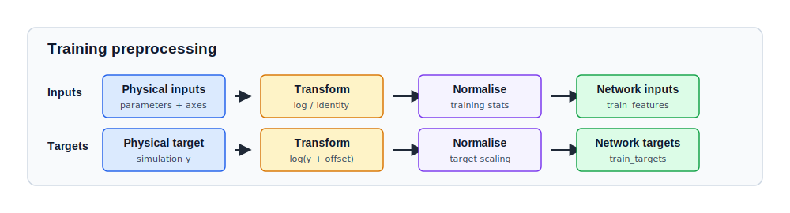
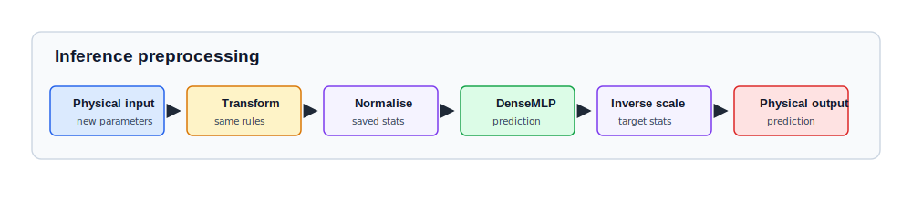

# Preprocessing and Normalisation

Preprocessing maps physical simulation parameters and targets into the numerical
space seen by the neural network.

## Motivation: Numerical Conditioning

Neural networks are sensitive to the dynamic range and distribution of their
inputs. Direct training on raw physical units is often inefficient or
numerically unstable due to:

* **Dynamic range**: astrophysical parameters such as $f_{\star}$ and $f_X$
  often span several orders of magnitude.
* **Dimensionality**: simulations may be sampled on grids that do not match the
  desired emulator resolution.

Preprocessing transforms the science problem into a numerically well-behaved
coordinate system that is easier for the optimiser to navigate.

## The Preprocessing Pipeline

The transformation from raw arrays to training-ready arrays follows a
deterministic pipeline:

1. **Cleaning**: remove failed simulations or NaN rows.
2. **Transformation**: apply monotonic maps such as $\log_{10}$.
3. **Splitting**: split simulations into train, validation, and test sets.
4. **Resampling**: interpolate simulations onto a shared coordinate grid.
5. **Tiling**: flatten grids into scalar regression rows.
6. **Scaling**: standardise features and targets using training-set statistics.

```text
raw arrays -> clean -> transform -> split -> resample -> tile -> scale
```

The split happens before scaling. This prevents validation and test data from
contributing to the means, standard deviations, or min/max values used by the
network.

## Key Operations

| Operation | Mathematical Map | Purpose |
| :--- | :--- | :--- |
| **Log Transform** | $x \rightarrow \log_{10}(x + \delta)$ | Compresses orders-of-magnitude variation. |
| **Z-Score** | $x \rightarrow \frac{x - \mu}{\sigma}$ | Centres features and normalises variance. |
| **Min-Max** | $x \rightarrow \frac{x - x_{min}}{x_{max} - x_{min}}$ | Maps bounded values onto a $[0, 1]$ or $[-1, 1]$ range. |
| **Tiling** | $(N_{sim}, N_z) \rightarrow (N_{sim} \times N_z, 1)$ | Converts spectral arrays into scalar regression samples. |

## Parameter and Axis Transforms

We explicitly separate **transforms** from **scaling**:

```text
physical value -> transform -> scale -> neural network
```

The inverse route is used after prediction:

```text
neural network -> inverse scale -> inverse transform -> physical value
```

### Parameter Processing

Raw parameter tables are filtered and transformed into a `PreparedFeatures`
object. This step records the final feature matrix, the feature names, and any
discrete parameter values.

```python
from jax_emu.data_preprocessing import prepare_feature_matrix

prepared_parameters = prepare_feature_matrix(
    raw_parameters,
    column_names=(
        "fstarII", "fstarIII", "Vc", "fX", "alpha", "nu_0",
        "zeta", "tau", "fradio", "pop", "feed", "delay",
    ),
    transform_params=("fstarII", "fstarIII", "Vc", "fX", "fradio"),
    discard_params=("zeta", "feed", "delay"),
    discrete_params=("alpha", "nu_0", "pop"),
)
```

The important product is `prepared_parameters.values`: the numerical parameter
matrix passed into the training split. `prepared_parameters.feature_names`
defines the parameter column order.

### Dataset Splitting

Splitting is done at the simulation level before tiling. This keeps a full
simulation target grid in only one split.

- **Training set**: Data used to update the model parameters.
- **Validation set**: Held-out data used during training to monitor
  generalization and drive early stopping.
- **Test set**: A final held-out split used after training to report emulator
  performance.

```python
from jax_emu.data_preprocessing import apply_transform, split_simulations

target_transform = "log10"  # use "identity" for linear-space targets
target_offset = 1e-8
transformed_targets = apply_transform(
    raw_target_data,
    transform=target_transform,
    offset=target_offset,
)

(
    train_parameters,
    validation_parameters,
    test_parameters,
    train_targets,
    validation_targets,
    test_targets,
) = split_simulations(
    prepared_parameters.values,
    transformed_targets,
    train_size=0.6,
    validation_size=0.2,
    test_size=0.2,
    random_state=42,
)
```

For `T21`, the target transform is usually `identity`. For `Delta21`, the target
transform is usually `log10` with the configured offset.

### Fixed-Grid Resampling

To ensure the network learns from aligned features, we resample every simulation
onto a shared axis grid, for example $z \in [6, 27]$ with 200 bins.
In practice, `axis_specs` comes from the emulator spec.

```python
from jax_emu.data_preprocessing import (
    build_fixed_axis_grid,
    resample_targets_to_grid,
    transformed_axis_configuration,
)

transformed_axes, transformed_limits = transformed_axis_configuration(
    axes=(z_axis, k_axis),
    axis_specs=axis_specs,
)
sampled_axes = build_fixed_axis_grid(transformed_axes, transformed_limits, axis_specs)

# Interpolate targets onto the shared coordinate system
train_target_grid = resample_targets_to_grid(
    train_targets,
    transformed_axes=transformed_axes,
    sampled_axes=sampled_axes,
)
validation_target_grid = resample_targets_to_grid(
    validation_targets,
    transformed_axes=transformed_axes,
    sampled_axes=sampled_axes,
)
```

### Tiling and Scaling

After resampling, each target grid is flattened into scalar rows. Each row is
one network example:

```text
[axis coordinates, transformed parameters] -> one scalar target
```

Feature scaling is fitted from the training rows only, then reused for
validation, test, and inference.

```python
from jax_emu.data_preprocessing import (
    FeatureScaler,
    FeatureScaling,
    flatten_resampled_rows,
)

train_features, train_target_rows = flatten_resampled_rows(
    train_parameters,
    train_target_grid,
    sampled_axes=sampled_axes,
)
validation_features, validation_target_rows = flatten_resampled_rows(
    validation_parameters,
    validation_target_grid,
    sampled_axes=sampled_axes,
)

feature_names = (
    *(axis.feature_name() for axis in axis_specs),
    *prepared_parameters.feature_names,
)

feature_scaling = tuple(
    FeatureScaling.from_values(
        name,
        train_features[:, idx],
        feature_scale_methods[name],
    )
    for idx, name in enumerate(feature_names)
)

feature_scaler = FeatureScaler(feature_scaling)
scaled_train_features = feature_scaler.transform(train_features)
scaled_validation_features = feature_scaler.transform(validation_features)
```

Target scaling is optional. In the current workflows it is one global standard
deviation measured from the transformed training targets, not one statistic per
redshift or k-bin.

## The Preprocessing Contract

The model weights alone are insufficient for science. Every trained emulator
package (`.nenemu`) bundles the **preprocessing contract**: the metadata needed
to reproduce the exact transforms and scaling used during training.

| Metadata Item | Importance |
| :--- | :--- |
| `emulator_spec` | Remembers which axes/parameters were logged and their physical order. |
| `input_scaling` | Stores the training-set statistics for every feature. |
| `target_scaling` | Stores the global target scaling, if target scaling was enabled. |
| `feature_names` | Records the input column order expected by the trained model. |

Training code saves this contract beside the model weights:

```python
from emulators_21cmspace.delta21.data import delta21_spec
from jax_emu.utils import CheckpointMetadata, save

metadata = CheckpointMetadata(
    model_name="delta21",
    package_version="0.1.0",
    emulator_spec=delta21_spec(),
    input_scaling=prepared.feature_scaling,
    target_scaling=prepared.target_scaling,
    training_config={"feature_names": list(prepared.feature_names)},
)

save(
    "delta21_model.nenemu",
    model,
    train_losses,
    validation_losses,
    "mse",
    metadata=metadata,
)
```

The checkpoint is therefore:

```text
model architecture + model weights + preprocessing contract
```



## Inference Workflow

During inference, the same metadata is loaded from the checkpoint:

1. **Forward transform**: map new physical parameters and coordinates to
   training space.
2. **Forward scale**: normalise inputs using the remembered training statistics.
3. **Model pass**: execute the JAX `DenseMLP` forward pass.
4. **Inverse scale**: undo target scaling, if it was used.
5. **Inverse transform**: undo physical target transforms such as
   $10^y - \delta$.
6. **Reconstruction**: fold flat predictions back into spectral arrays.

```python
from emulators_21cmspace.delta21.infer import load_delta21_package, predict_delta21

package = load_delta21_package("delta21_model.nenemu")

delta21 = predict_delta21(
    package,
    parameters=physical_parameters,
    z_values=z_grid,
    k_values=k_grid,
)
```

Inside `predict_delta21`, `metadata.emulator_spec` supplies the transforms,
`metadata.input_scaling` supplies the input normalisation, and
`metadata.target_scaling` supplies the inverse target scaling.


